# Technical Questions App

## Overview

**Technical Questions App** is an interactive coding practice platform built for students at **Union College of Union County, NJ (UCNJ)**. Designed to simulate real-world technical interviews, it helps students sharpen their skills in **Python** and **SQL** through hands-on problem solving.

Students can register, log in, browse categorized questions, write and submit code directly in the browser, and receive instant feedback. The platform features built-in progress tracking and secure sandboxed code evaluation, all wrapped in a responsive, user-friendly interface.

## Table of Contents
- [Overview](#overview)
- [Purpose](#purpose)
- [Project Structure](#project-structure)
- [Key Features](#key-features)
- [Admin & Superadmin Dashboards](#admin--superadmin-dashboards)
- [Running the App](#running-the-app)
  - [Prerequisites](#prerequisites)
  - [Environment Setup Instructions](#environment-setup-instructions)
    - [Python](#python)
    - [MySQL](#mysql)
    - [Visual Studio Code](#visual-studio-code)
    - [Docker](#docker)
  - [Application Setup Instructions](#application-setup-instructions)
- [Docker Integration](#docker-integration)
- [Database Migration](#database-migration)
- [Testing](#testing)
- [Technologies Used](#technologies-used)
- [Contribution Guidelines](#contribution-guidelines)
- [License](#license)

## Purpose

This project was created to:

- Help UCNJ students practice for coding interviews at their own pace.
- Build fluency in Python and SQL through real-world challenges.
- Track individual student progress across categories.
- Introduce students to a modern, browser-based coding workflow.

## Project Structure

```
Technical-Questions-App/
├── app/
│   ├── __init__.py
│   ├── account_settings.py
│   ├── comments.py
│   ├── db.py
│   ├── feedback.py
│   ├── forgot_password.py
│   ├── login.py
│   ├── mailer.py
│   ├── python_evaluator.py
│   ├── question_aggregates.py
│   ├── questions.py
│   ├── register.py
│   ├── reset_password.py
│   ├── routes.py
│   ├── sql_evaluator.py
│   ├── sql_table_metadata.py
│   ├── user_submissions.py
│   ├── user_validators.py
│   ├── admin/
│   │   ├── __init__.py
│   │   ├── dashboard.py
│   │   ├── feedback.py
│   │   ├── questions.py
│   │   ├── routes.py
│   │   ├── submissions.py
│   │   ├── test_cases.py
│   │   ├── tools.py
│   │   ├── users.py
│   │   └── utils.py
│   ├── data/
│   │   ├── answer_key.json
│   │   └── questions.json
│   ├── grader/
│   │   └── Dockerfile
│   ├── scripts/
│   │   ├── migrate_questions.py
│   │   └── migrate_test_cases.py
│   ├── static/
│   │   ├── css/
│   │   │   ├── admin.css
│   │   │   ├── certifications.css
│   │   │   ├── events.css
│   │   │   └── ucnj_style.css
│   │   ├── images/
│   │   │   ├── emilio.PNG
│   │   │   ├── linux-intro.jpg
│   │   │   ├── scavenger-hunt.svg
│   │   │   ├── thumbs-up.svg
│   │   │   ├── visualization-jam.jpg
│   │   │   └── favicon.ico
│   │   ├── js/
│   │   │   ├── account_settings.js
│   │   │   ├── add_question.js
│   │   │   ├── code_editor.js
│   │   │   ├── comment_voting.js
│   │   │   ├── comments.js
│   │   │   ├── flash.js
│   │   │   ├── handle_not_logged.js
│   │   │   ├── login.js
│   │   │   ├── question_filter.js
│   │   │   ├── question_sort.js
│   │   │   ├── register.js
│   │   │   ├── reset_password.js
│   │   │   └── test_cases.js
│   ├── templates/
│   │   ├── admin/
│   │   │   ├── add_question.html
│   │   │   ├── dashboard.html
│   │   │   ├── edit_question_list.html
│   │   │   ├── edit_question.html
│   │   │   ├── edit_submissions.html
│   │   │   ├── feedback_inbox.html
│   │   │   ├── manage_submissions.html
│   │   │   ├── manage_test_cases.html
│   │   │   ├── tools.html
│   │   │   ├── user_list.html
│   │   │   └── view_submissions.html
│   │   ├── account_settings.html
│   │   ├── base.html
│   │   ├── certifications.html
│   │   ├── events.html
│   │   ├── feedback.html
│   │   ├── forgot_password.html
│   │   ├── home.html
│   │   ├── login.html
│   │   ├── question_detail.html
│   │   ├── questions.html
│   │   ├── register.html
│   │   └── reset_password.html
│   ├── test/
│   │   ├── test_email_sender.py
│   │   ├── test_mysql_connection.py
│   │   ├── test_python_evaluator.py
│   │   └── test_sql_evaluator.py
├── database/
│   ├── schema.sql
│   └── README.md
├── .env
├── .gitignore
├── config.py
├── LICENSE
├── README.md
├── run.py
└── student_code.py
```

## Key Features

### 1. User Authentication

Users can create accounts with a username, email, and password.


Passwords are securely hashed using bcrypt.

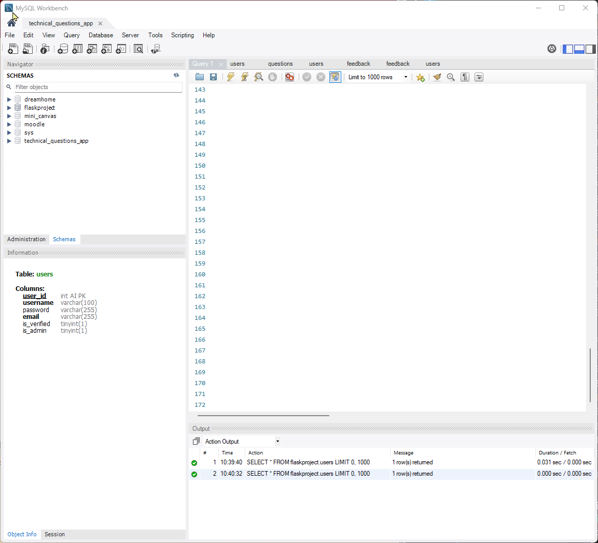

Session management is handled through Flask's built-in session system.

### 2. Question Management

Questions are stored in a MySQL database and organized into three categories: Computer Science, Data Science, and Databases.

Each question includes a title, slug, category, language, prompt, and a set of test cases for evaluation.

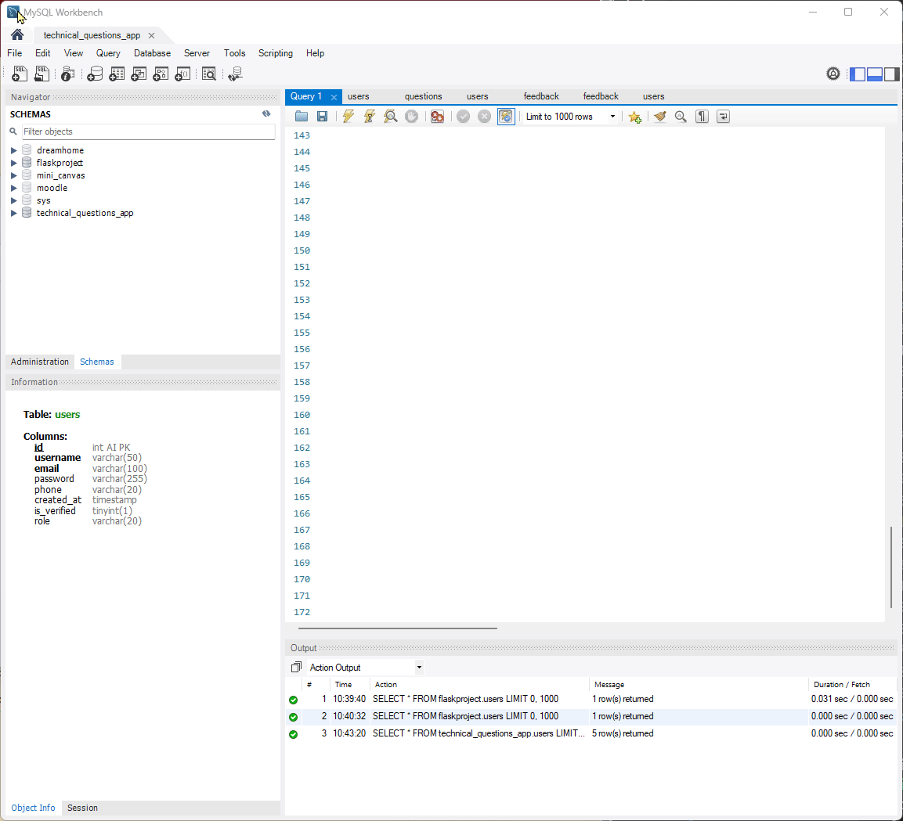

### 3. Code Evaluation

Python code is executed in a secure, sandboxed environment using Docker to prevent unsafe behavior.  
SQL submissions are executed against an in-memory test database and evaluated based on expected output.


### 4. Language Toggle with Persistence

Each question supports both Python and SQL implementations.  
Users can switch between the two languages, and their selection is retained across reloads and submissions.


### 5. Theme Switching

The interface supports both light and dark themes.  
The selected theme is saved using localStorage and applied consistently across sessions.
However, this light/dark theme is not applied to the whole page, only the textarea for coding.

### 6. Progress Tracking

Users can monitor their progress within each category.  
Both the total number of questions and the number completed are displayed using visual progress indicators.


### 7. Account Settings

Users can manage their account through the settings page.  
They can change their password, update their phone number, and verify their email address.  
Progress data is displayed using a card-based layout for clarity.

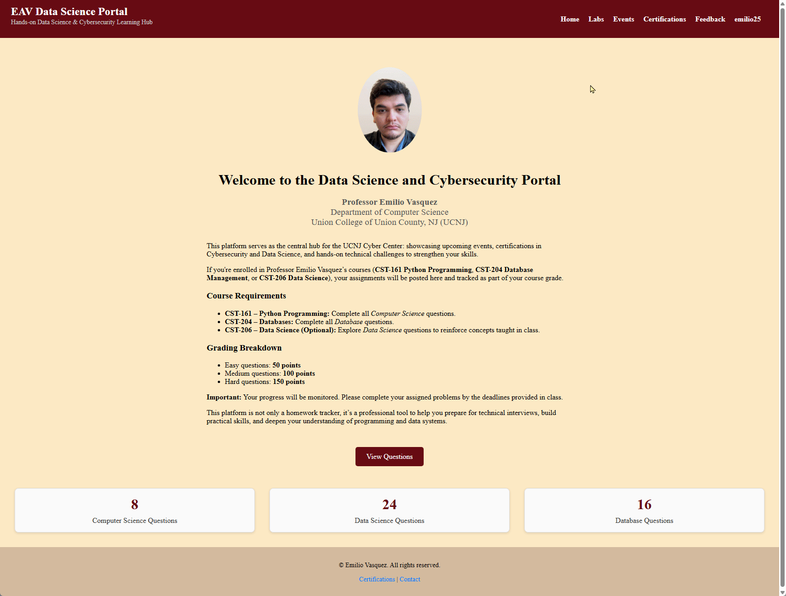

### 8. Question Submission and Feedback

Users can submit solutions to each question and immediately view evaluation results.  
A dedicated feedback page is available for users to submit comments or suggestions about the platform.

This is the **feedback** mechanisms:

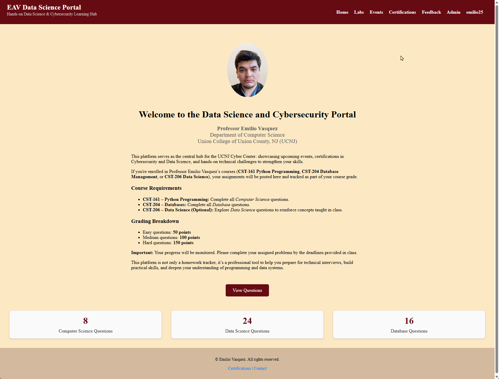

### 9. Comment System with Voting & Replies

Each question includes a dedicated **comment thread** where users can:

- Post comments and discuss approaches to solutions.  
- Upvote or downvote comments to surface the most helpful responses.  
- Reply directly to other comments (recursive structure), creating nested threads for clearer discussions.  
- View threads in a clean, indented layout for readability.  

This feature helps students collaborate, share insights, and build a peer-learning environment directly within the platform.


### 10. Admin & Superadmin Dashboards

Role-based tools for moderation, question/test-case management, submission triage/export, and user administration with superadmin only controls.

**Regular people do not have the admin tab**

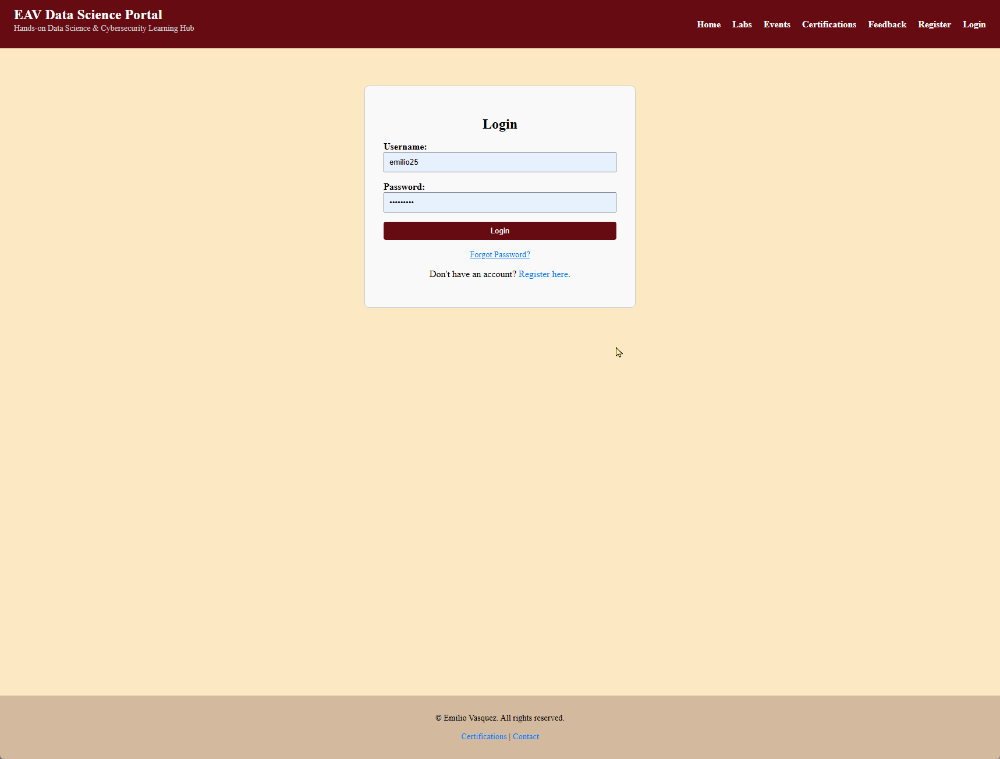

**Admins have the admin tab** but it does not contain all the tools.

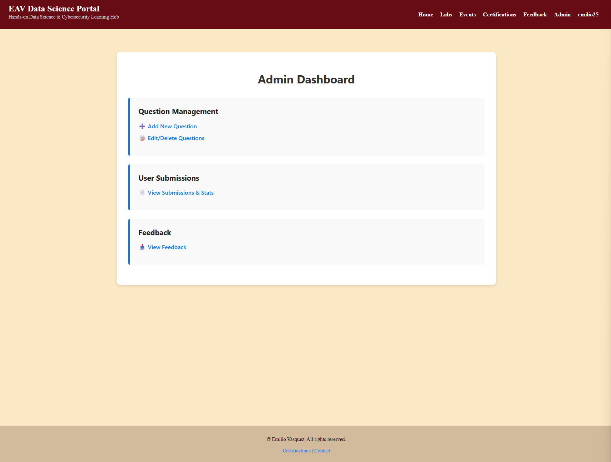

**Superadmins have the admin tab and all tools**.


## Admin & Superadmin Dashboards

This app includes **role-based access control (RBAC)** with two privileged roles:

| Capability | Authenticated User | Admin | Superadmin |
|------------|--------------------|-------|------------|
| Browse/solve questions | ✅ | ✅ | ✅ |
| View My Submissions | ✅ | ✅ | ✅ |
| Admin Dashboard (`/admin/dashboard`) | ❌ | ✅ | ✅ |
| Manage Questions (`/admin/questions`) | ❌ | ✅ | ✅ |
| Manage Test Cases (`/admin/manage_test_cases`) | ❌ | ✅ | ✅ |
| Feedback Inbox (`/admin/feedback_inbox`) | ❌ | ✅ | ✅ |
| View Submissions (`/admin/view_submissions`) | ❌ | ✅ | ✅ |
| **Superadmin Submissions Management** (`/admin/manage_submissions`) | ❌ | ❌ | ✅ |
| **User Management** (`/admin/user_list`) | ❌ | ❌ | ✅ |
| **Tools (system-level)** (`/admin/tools`) | ❌ | ❌ | ✅ |

## Running the App

### Prerequisites

- Python 3.9 or higher  
- Docker installed and running(required for Python grader sandbox)
- MySQL server with appropriate user credentials

### Environment Setup Instructions:

#### Python

[Python Download](https://www.python.org/downloads/)

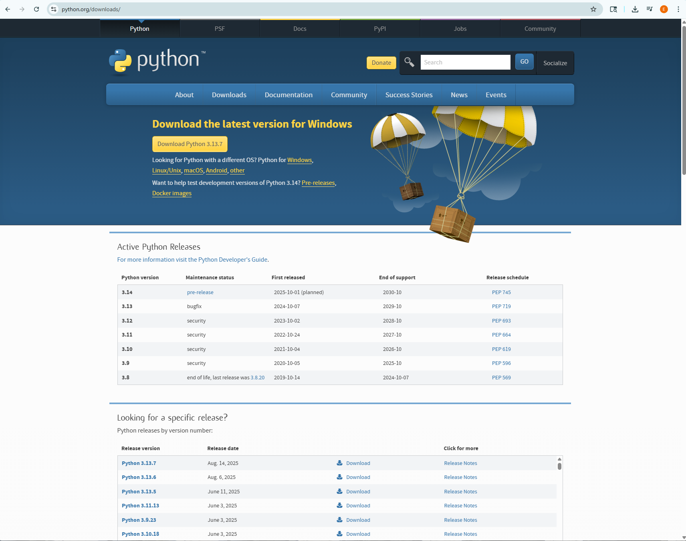

**Once Python is downloaded** open up your terminal.
- **If** you're on **MacOS**, you should use **finder** to open up terminal. Or it should be at the top of your computer screen.
- **If** you're on **Windows**, you should use the **windows search box** and type **cmd** to open up the command-line interface.

**Now** that youre **terminal is open**:
- **If** you're on **MacOS** type: `python3 --version` and press **enter**
- **If** you're on **Windows** type: `python --version` and press **enter**

After you run this command, you should see: `Python 3.xx.x` where the **x** stands for the **version** of your python download.

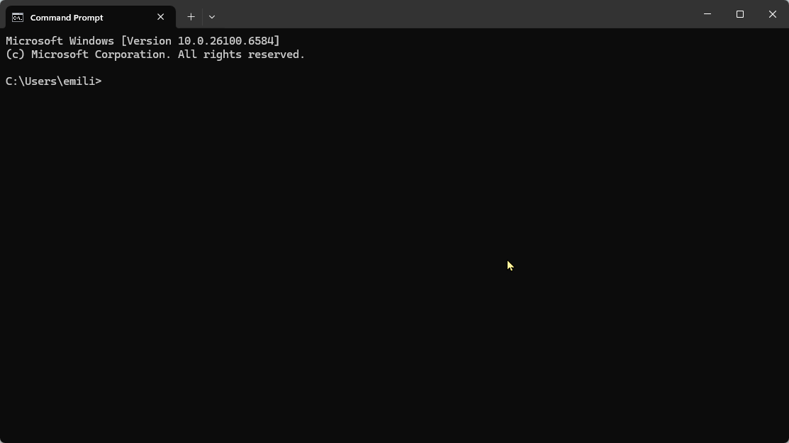

**If** your terminal does **not** show the python version, it may be because of python is not inside of your **system variables**.

**To fix this:** open up `environment variables` via your **windows search box**

**Then** open up `edit environment variables...` tab, once that **pops** up, you should click `edit environment variables`.

**After** clicking `edit environment variables`, you should get **one screen** displaying **user variables** and **system variables**. **Search** under the **system variables** for the `path` section, once you find that `path` section, click it, it should now turn **blue** as it's been highlighted. **Now click** `edit`.

**This is where you want to add the location of your Python download**.

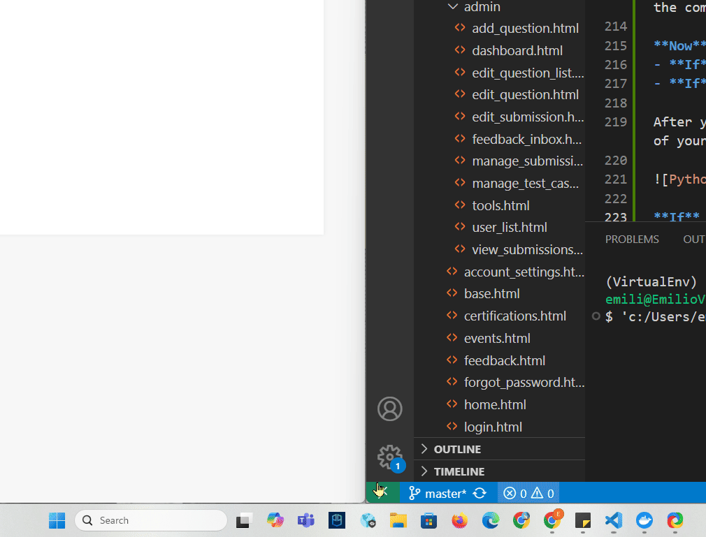

**If you don't know the location of the Python download** please visit this [video](https://www.youtube.com/watch?v=po7_02HLP0c&list=PL-yGP0RJ99EGbiGxTswNZqffoAqz1IGCe&index=3)

**After** you added the correct Python download path. Press `ok` through the screens to save the path you added.

**Now** open up your terminal again and check if your Python download is now integrated into your system by running the `python --version` command.

#### MySQL

MySQL Download:
- [MacOS Download](https://dev.mysql.com/downloads/mysql/8.0.html)
- [Windows/Linux Download](https://dev.mysql.com/downloads/installer/)

**Windows Users: Install the minimum version** of MySQL.

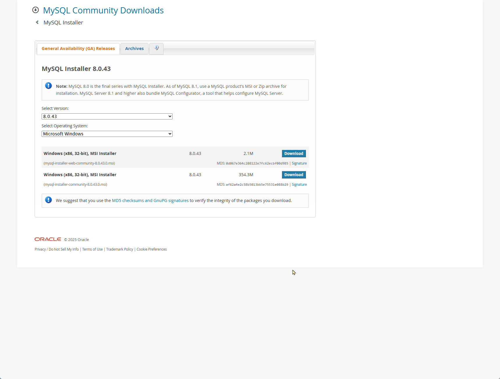

**Once** the installer is ready, open it and setup the **server** and the **workbench** only. If you need help with this portion, go to this [video](https://www.youtube.com/watch?v=Hdb7wgE0RJw)

#### Visual Studio Code

[Visual Studio Code Download](https://code.visualstudio.com/download)

#### Docker

**In order** to run our python tester in an isolated environment, we will be using Docker Desktop.

The setup is simple, we just need to install [Docker Desktop](https://www.docker.com/products/docker-desktop/).

Then create an account with Docker **for free**, and **Visual Studio Code** should integrate your login of Docker automatically.

Once you have **downloaded docker and created an account** your Docker Desktop should look similar to this:

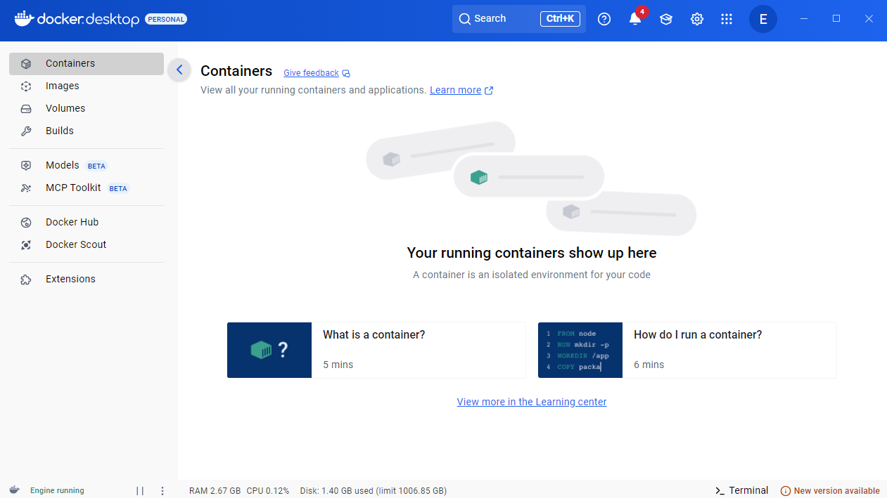

### Application Setup Instructions

1. Clone the repository:
   ```bash
   git clone <repository-url>
   cd Technical-Questions-App
   ```
2. Create a virtual environment and install dependencies:
   ```bash
   python -m venv venv
   source venv/bin/activate
   pip install -r requirements.txt
   ```
3. Setup `.env` file with database credentials and secrets.
4. Run the migration script:
   ```bash
   python -m app.scripts.migrate_questions
   python -m app.scripts.migrate_test_cases
   ```
   > Note: The question data must be provided by you. The app expects a file named questions.json located in the app/data/ directory.
   > You must create this file yourself or acquire it from a source you trust.
   The file should follow this structure for Python questions:
   ```json
   [
        {
            "id": 1,
            "title": "",
            "slug": "",
            "prompt": "",
            "language": "python",
            "category": "Computer Science",
            "difficulty": "",
            "function_signature": "def solution(nums, target):",
            "test_cases": [
            {
                "input": "",
                "expected_output": "",
                "description": ""
            }
            ]
        }
    ]
   ```

   For SQL questions, replace the `language`, `function_signature`, and ``test_cases` accordingly:
   ```json
   {
        "language": "sql",
        "test_cases": [
            {
            "description": "Find empty neighborhoods",
            "setup_sql": "CREATE TABLE users (id INT, neighborhood VARCHAR(100)); INSERT INTO users VALUES (1, 'Downtown');",
            "expected_output": []
            }
        ]
    }
    ```

5. To start the app, run this in your **root directory**:
   ```bash
   python run.py
   ```

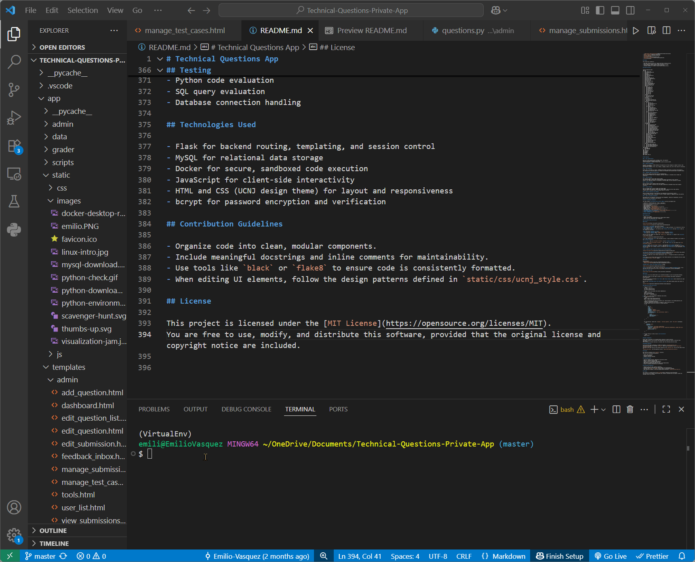

## Docker Integration

Python code is executed in an isolated Docker container to ensure security.  
The grader container runs the user’s code separately and returns the result to the main Flask application.  
This architecture prevents malicious or unstable code from affecting the host system.

## Database Migration

Initial question data is defined in a JSON file located at `app/data/questions.json`.  
This data is imported into the MySQL `questions` table using the migration script `app/scripts/migrate_questions.py`.
The data for the test cases are also within the keys of the `questions.json` file, but the table filled is
`question_test_cases`, and the migration script is `app/scripts/migrate_test_cases.py`.

## Testing

Unit tests are located in the `app/test/` directory.  
They cover the following functionality:

- Python code evaluation
- SQL query evaluation
- Database connection handling

## Technologies Used

- Flask for backend routing, templating, and session control  
- MySQL for relational data storage  
- Docker for secure, sandboxed code execution  
- JavaScript for client-side interactivity  
- HTML and CSS (UCNJ design theme) for layout and responsiveness  
- bcrypt for password encryption and verification

## Contribution Guidelines

- Organize code into clean, modular components.
- Include meaningful docstrings and inline comments for maintainability.
- Use tools like `black` or `flake8` to ensure code is consistently formatted.
- When editing UI elements, follow the design patterns defined in `static/css/ucnj_style.css`.

## License

This project is licensed under the [MIT License](https://opensource.org/licenses/MIT).  
You are free to use, modify, and distribute this software, provided that the original license and copyright notice are included.

